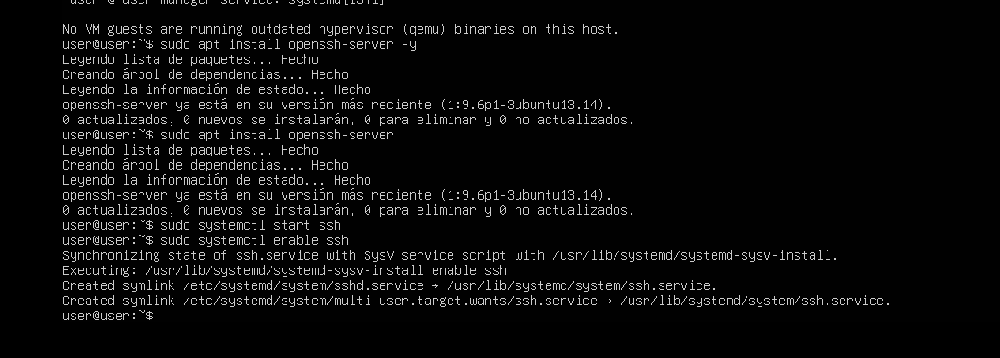
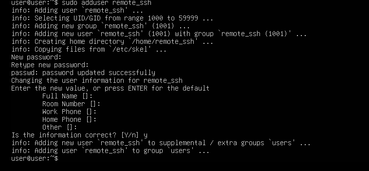
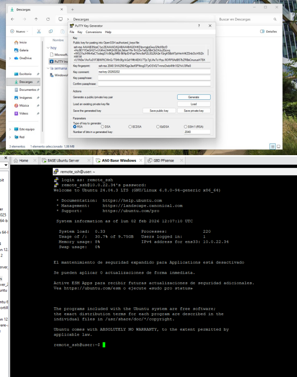
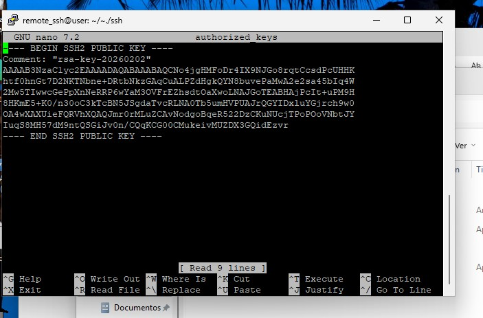
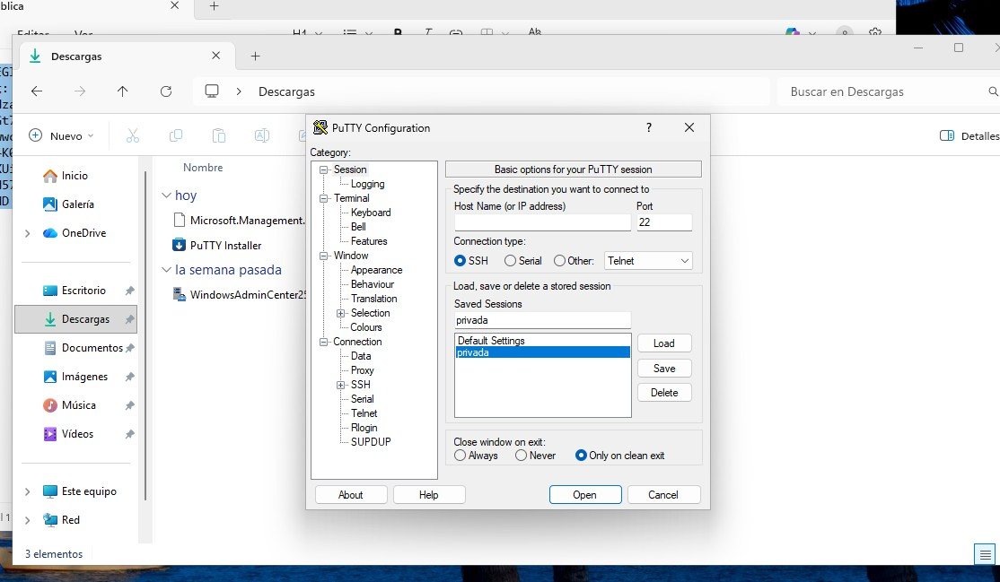
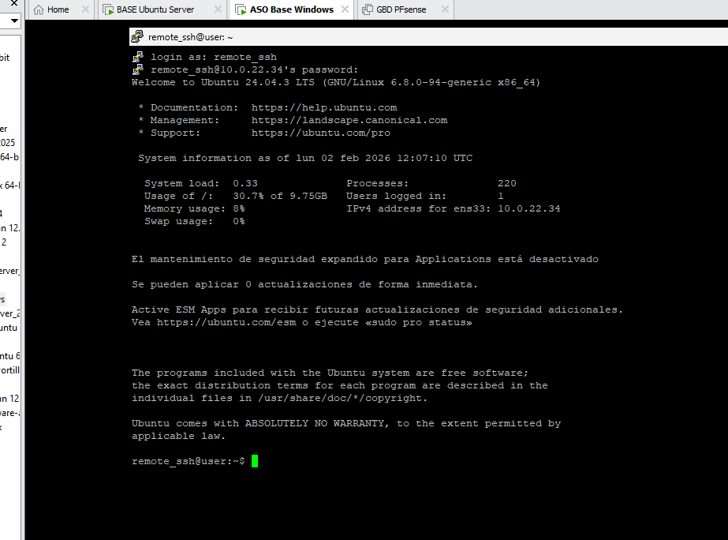
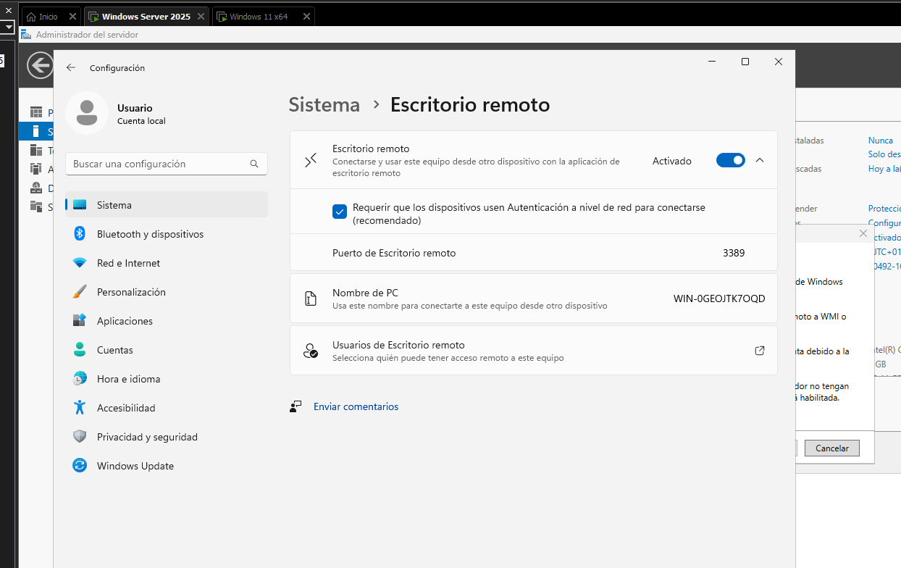
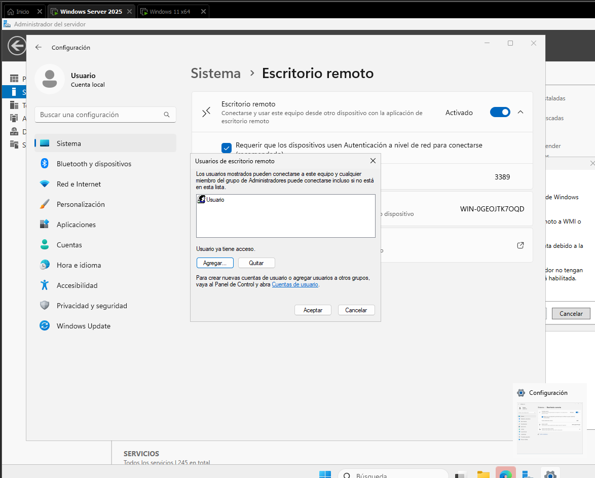

# ADMINISTRACIÓN REMOTA DE SISTEMAS
## Acceso SSH
Usuario autorizado: remoto_ssh  
Cliente: PuTTY  
Autenticación: clave pública  
Contraseña por SSH: deshabilitada  
Usuarios no autorizados: acceso denegado  
### 1. Verificación del servicio SSH
Lo primero es asegurarse de que el servicio SSH esté activo y en ejecución en el servidor, ya que es necesario para conectarse desde PuTTY en Windows 11.

### 2. Creación de un usuario para administración remota
Es recomendable no utilizar el usuario root para conexiones SSH. Crea un usuario específico con privilegios administrativos para gestionar el servidor de forma remota.

### 3. Generación y configuración de claves SSH
Desde Windows 11, genera un par de claves pública/privada. Luego convierte la clave privada al formato `.ppk` que PuTTY entiende (por ejemplo, usando PuTTYgen). Finalmente, copia la clave pública al servidor en el directorio `~/.ssh/authorized_keys` del usuario remoto (puedes usar `scp` para transferirla).

### 4. Ajustes en la configuración del servidor SSH
Edita el archivo de configuración de SSH (`/etc/ssh/sshd_config`) para reforzar la seguridad:

- `PubkeyAuthentication yes` → permite autenticación con clave pública.
- `PasswordAuthentication no` → deshabilita el acceso mediante contraseña.

Después de los cambios, reinicia el servicio SSH.

### 5. Conexión exitosa con el usuario remoto
Configura PuTTY con la clave privada en formato `.ppk`, indica la IP del servidor y el usuario remoto. Al conectar, deberías acceder directamente sin pedir contraseña.

### 6. Intento de conexión con otro usuario
Si intentas conectar con un usuario diferente que no tiene la clave pública configurada, el acceso será rechazado.

## Acceso vía RDP (Windows Server 2025)

- **Usuario RDP**: remoto_rdp  
- **Sistema**: Windows Server 2025  
- **Protocolo**: RDP  
- **Grupo de acceso**: Usuarios de Escritorio remoto  
- **Cifrado**: Habilitado

### 1. Habilitación de Escritorio Remoto y autenticación a nivel de red
Desde el Administrador del servidor, activa la opción de **Escritorio Remoto**. Es importante habilitar la **Autenticación a nivel de red** para mayor seguridad, ya que solo permitirá conexiones desde clientes compatibles en la red.

### 2. Creación del usuario y asignación al grupo adecuado
Crea un usuario específico para acceso remoto y agrégalo al grupo local **Usuarios de Escritorio remoto**. Esto le otorga permiso para conectarse mediante RDP.

### 3. Conexión exitosa desde el cliente
En el equipo cliente, abre la aplicación **Conexión a Escritorio remoto**, introduce la IP o nombre del servidor, y las credenciales del usuario remoto_rdp.

