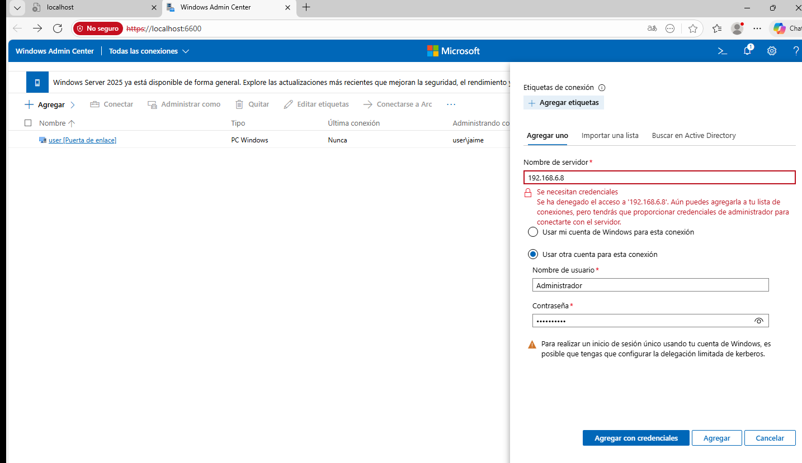
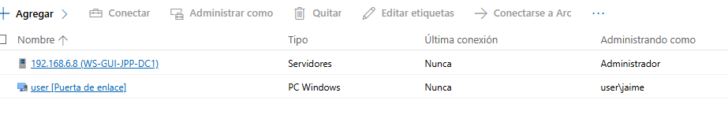
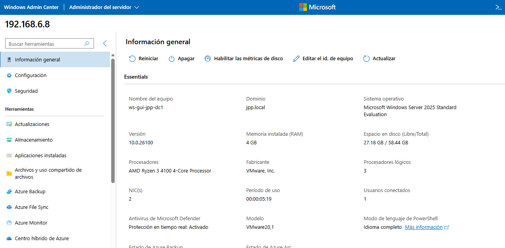
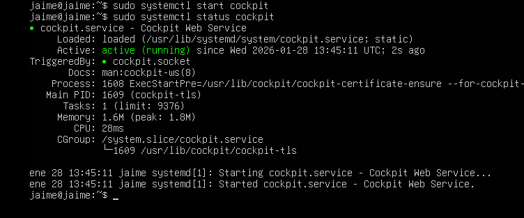
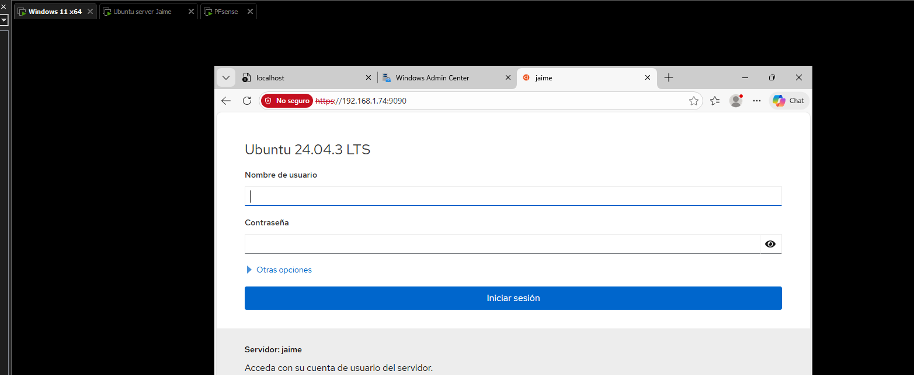
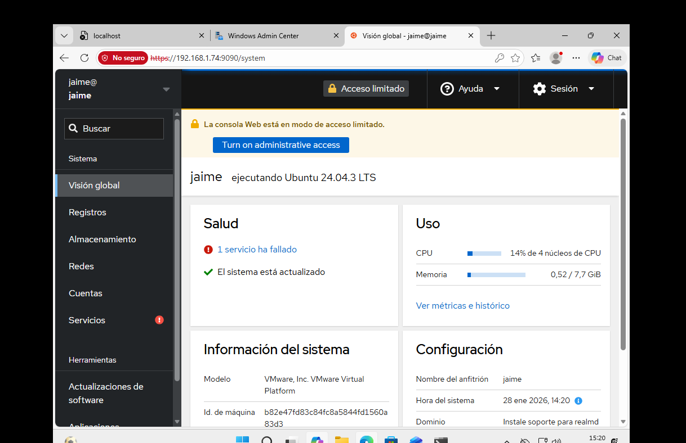
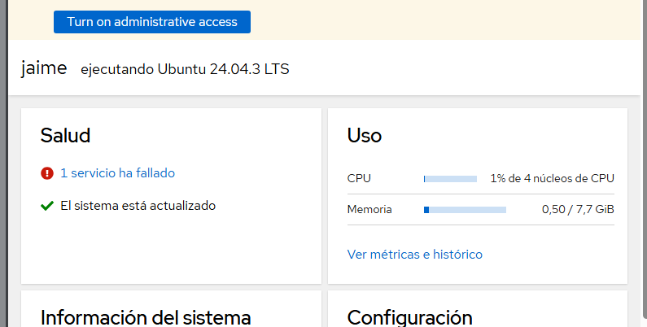

# UT4 - Administración remota con WAC (Windows Admin Center) y Cockpit

## Documentación de WAC (Windows Admin Center)

Windows Admin Center (WAC) es una herramienta desarrollada por Microsoft que permite la **administración remota de servidores Windows** a través de una **interfaz web**. Mediante WAC es posible supervisar el estado del sistema, consultar los servicios y procesos activos, así como controlar el consumo de **CPU y memoria**, todo ello sin necesidad de acceder físicamente al servidor.

## 1. Acceso a WAC

Para utilizar correctamente Windows Admin Center, es necesario instalarlo en un equipo con **Windows 11**, que actuará como intermediario para la gestión de un servidor con **Windows Server**. Durante la instalación o configuración inicial, se asigna un **puerto de acceso**, que habitualmente es el **6600**, a través del cual se accede a la consola web.

Una vez dentro de la interfaz principal de WAC, se deben introducir las credenciales de un **usuario con permisos de administración remota** o del **administrador del sistema**, ya que son necesarias para establecer la conexión con el servidor gestionado.






## 2. Administración remota del servidor

Una vez establecida la conexión con el servidor, la **pantalla principal** de la herramienta muestra información clave sobre los componentes del sistema, así como **datos generales del servidor**. Esto permite tener una visión rápida del estado del equipo y de los recursos disponibles para su gestión remota.



| Sistema | Herramienta | Protocolo | Puerto |
|:----------------------:|:-------------:|:-----------:|:--------:|
| Windows Server 2025 |  WAC | HTTPS, WinRM, SMB, Kerberos | 6600 (HTTPS)  
## 1. Estado del servicio de Cockpit y el socket

Para verificar si el servicio de **Cockpit** y su **socket** están activos, se puede utilizar el siguiente comando en la terminal:

```bash
sudo systemctl status cockpit
```


## 2. Creación del usuario y asignación al grupo sudo

Para realizar tareas de **monitorización remota**, es recomendable crear un usuario dedicado. Esto se puede hacer con el siguiente comando:

```bash
sudo adduser remoto
```




## 3. Acceso a Cockpit desde el equipo cliente y visualización de la interfaz

Para supervisar el rendimiento de **Ubuntu Server**, he utilizado **Ubuntu Desktop** como equipo cliente, en lugar de Windows 11, con el objetivo de mejorar el rendimiento general del sistema durante la monitorización.

Una vez comprobado que el **servicio de Cockpit** está activo y creado el usuario dedicado para la administración remota, se puede acceder a la **interfaz web**. Para ello, se introduce en el navegador la dirección IP del servidor junto con el **puerto 9090**, que es el puerto por defecto para conexiones HTTPS. Por ejemplo: https://192.168.1.74:9090




| Sistema | Usuario remoto | Herramienta | Protocolo | Puerto |
|:---------:|:----------------:|:-------------:|:-----------:|:--------:|
| Ubuntu Server | Monitor | Cockpit | HTTPS | 9090 |
